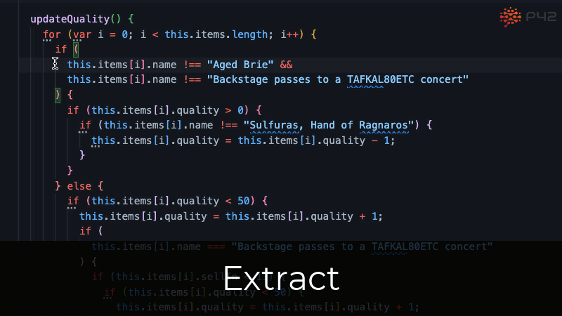

# Extract code
First, **select the source code you want to extract** with the mouse or the keyboard. 

> 💡&nbsp;&nbsp;The selection has to be exact, i.e., it has to start at the beginning of the element and end right after. For example, a trailing semicolon should not be part of the selection.

The smart expand & shrink selection shortcuts can be beneficial to select semantic elements accurately and quickly:

| | Mac shortcut | Windows/Linux shortcut |
| :-- | --: | --: |
| **Smart expand selection** | <kbd>⌃</kbd> + <kbd>⇧</kbd> + <kbd>⌘</kbd> + <kbd>→</kbd> | <kbd>⇧</kbd> + <kbd>Alt</kbd> + <kbd>→</kbd>
| **Smart shrink selection** | <kbd>⌃</kbd> + <kbd>⇧</kbd> + <kbd>⌘</kbd> + <kbd>←</kbd> | <kbd>⇧</kbd> + <kbd>Alt</kbd> + <kbd>←</kbd>

After selecting the code, you can **invoke extract** using the quick-fix or refactor context menus. 
It is also possible to directly trigger extract by pressing the extract keyboard shortcut:

| | Mac shortcut | Windows/Linux shortcut |
| :-- | --: | --: |
| **E<ins>x</ins>tract** | <kbd>⌃</kbd> + <kbd>⌘</kbd> + <kbd>X</kbd> | <kbd>Ctrl</kbd> + <kbd>Alt</kbd> + <kbd>X</kbd> |
&nbsp;
> 💡&nbsp;&nbsp;When there is more than one possible extract action, a context menu will appear.

After the extract operation, some refactorings automatically trigger a rename, e.g., to help you quickly enter a fitting variable name.

# Available extract actions
* [Extract variable (multiple occurrences)](https://p42.ai/documentation/code-assist/extract-variable)
* [Extract selected text into variable](https://p42.ai/documentation/code-assist/extract-substring-to-variable)
* [Extract React function component](https://p42.ai/documentation/code-assist/extract-jsx-element)